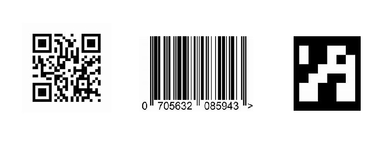

[](https://pypi.python.org/pypi/scikit-spatial)
[](https://anaconda.org/conda-forge/scikit-spatial)
[](https://pypi.python.org/pypi/scikit-spatial)


# Introduction

This code provides examples of the using RealSense camera for detection of Image objects.
The object detection is based on RGB values of the camera.
The following objects are supported:

-   Barcodes, QR Codes : detected by using  external library
-   ArucoMarkers : using OpenCV

These objects could be integrated in your robotics and video processing pipe line.


# Modules

We are using 


## Installation Windows

1. install python and virtual environment:
2. 

## Usage

```py
>>> from skspatial.objects import Vector

>>> vector = Vector([2, 0, 0])

```