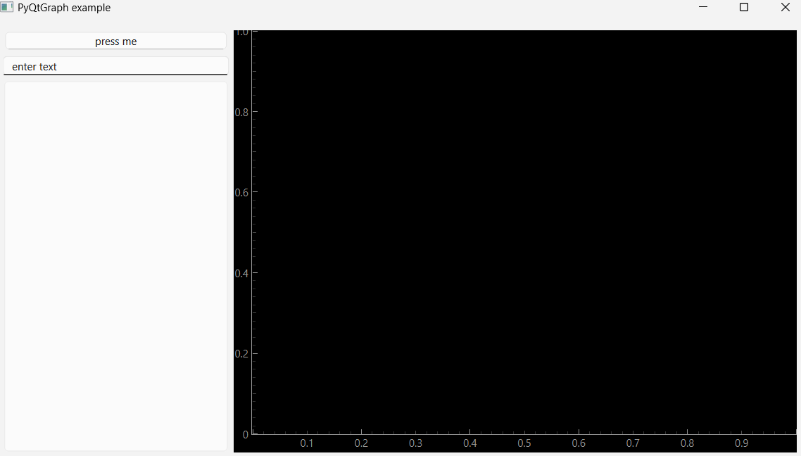

[](https://pypi.python.org/pypi/scikit-spatial)


# Introduction

This code provides examples of the using RealSense camera and PyQT GUI applications.
The following examples are:

-   How to create a simple QT applications
-   Integrate it with OpenCV and Real Sense

These examples could be integrated in your application and video processing pipe line.


# Modules and License

We are using PySide6 and opencv contributions to develop the applications.


# Installation on Windows

1. Install python 3.10 from Python Release Python 3.10.0 | <https://www.python.org>

2. Create virtual environment. In Windows PowerShell:

    python -m venv <your path>\Envs\pyqt

3. Activate virtual environment. In Windows CMD shell:

    <your path>\Envs\pyqt\Scripts\activate.bat

4. Installing realsense driver. For example, download pyrealsense2-2.55.10.6089-cp310-cp310-win_amd64.whl:

    pip install pyrealsense2-2.55.10.6089-cp310-cp310-win_amd64.whl

5. Install opencv and numpy:

    pip install opencv-contrib-python

6. Instrall PySide6 library (requires also Clang library (C-bindings) see : https://pypi.org/project/PySide6/):

    pip install PySide6

7. Install QtGraph:

    pip install  pyqtgraph


# Usage

In the command line : 
```
(qtgui) ... > python .\trial\pyqt_example1.py

```
result 


# Troubleshooting

None