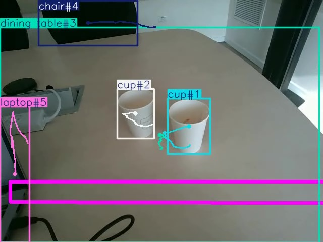

[](https://pypi.python.org/pypi/scikit-spatial)


## Introduction to Ultralytics YOLOv8 Applications using RealSense Camera


This code provides examples of the using RealSense camera for detection of RGB and Depth objects.
This repository features a collection of real-world applications. 
Explore the examples below to see how YOLOv8 can be integrated into various applications.
The following objects are supported:

-   Objects   : 2D objects detected from RGB stream
-   Counting  : Counting objects entering particular region  
-   Tracking  : Tracking objects in RGB stream

These objects could be integrated in your robotics and video processing pipe line.

## Installation Windows

1. install python and virtual environment: similar 
2. 

## Usage

```py
>>> from yolo_detector import yolo_detector

>>> pd = yolo_detector()

```

### Ultralytics YOLO Example Applications

Please visit Ultralitics [YOLO](https://docs.ultralytics.com/) 

### How to Contribute

We greatly appreciate contributions from the community, including examples, applications, and guides. If you'd like to contribute, please follow these guidelines:

1. **Create a pull request (PR)** with the title prefix `[Example]`, adding your new example folder to the `examples/` directory within the repository.

2. **Ensure your project adheres to the following standards:**
   - Makes use of the `ultralytics` package.
   - Includes a `README.md` with clear instructions for setting up and running the example.
   - Avoids adding large files or dependencies unless they are absolutely necessary for the example.
   - Contributors should be willing to provide support for their examples and address related issues.

For more detailed information and guidance on contributing, please visit our [contribution documentation](https://docs.ultralytics.com/help/contributing).

If you encounter any questions or concerns regarding these guidelines, feel free to open a PR or an issue in the repository, and we will assist you in the contribution process.
